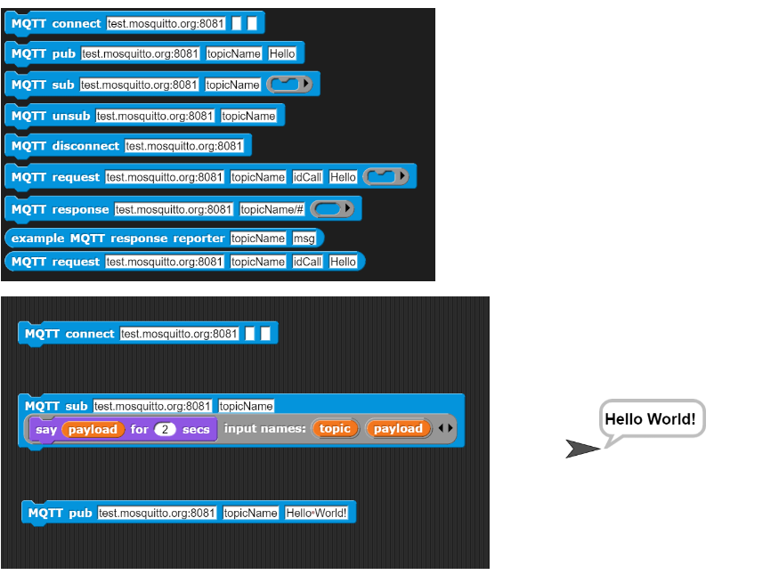

# MQTT4Snap!

MQTT4Snap! is a Snap! library for using MQTT in Snap! and Snap4Arduino.

The default broker is  [test.mosquitto.org](http://www.mosquitto.org).

### Blocks and usage

Import  mqtt4snap_standalone.xml into Snap!

Here you can see the blocks and a simple example to test:

 
 
### Acknowledgents

Of course, this project wouldn't exist without:

- [MQTT.js](https://github.com/mqttjs)
- The "fetch JavaScript" from [Bernat Romagosa](https://github.com/bromagosa)

