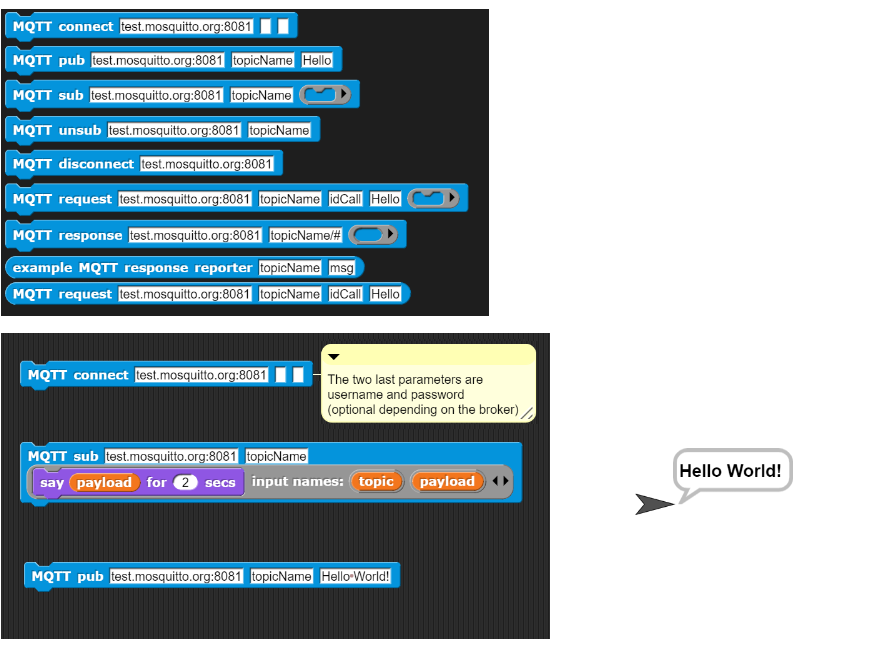
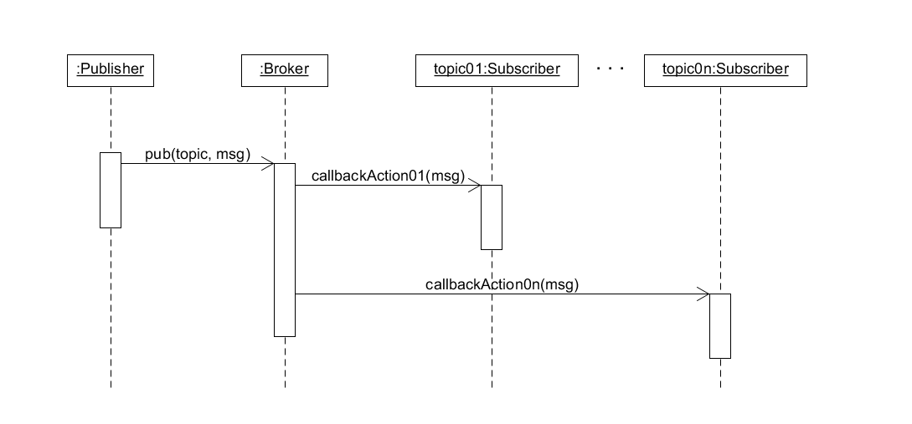
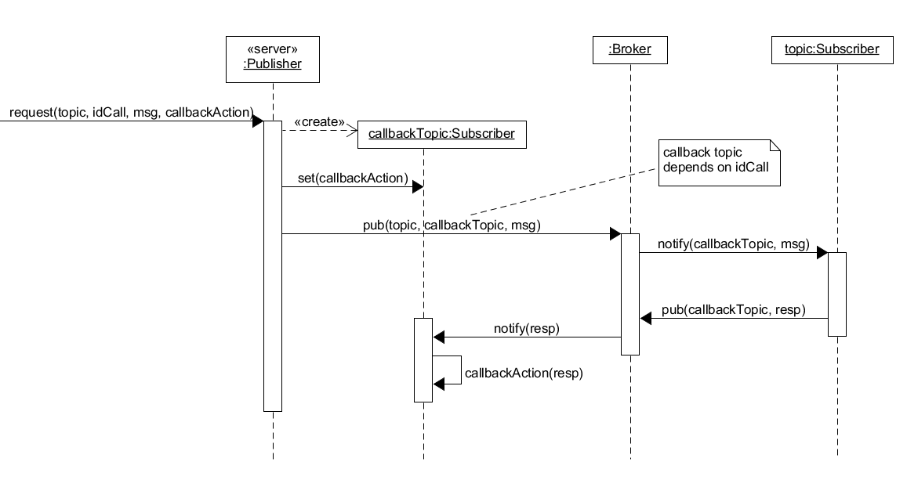
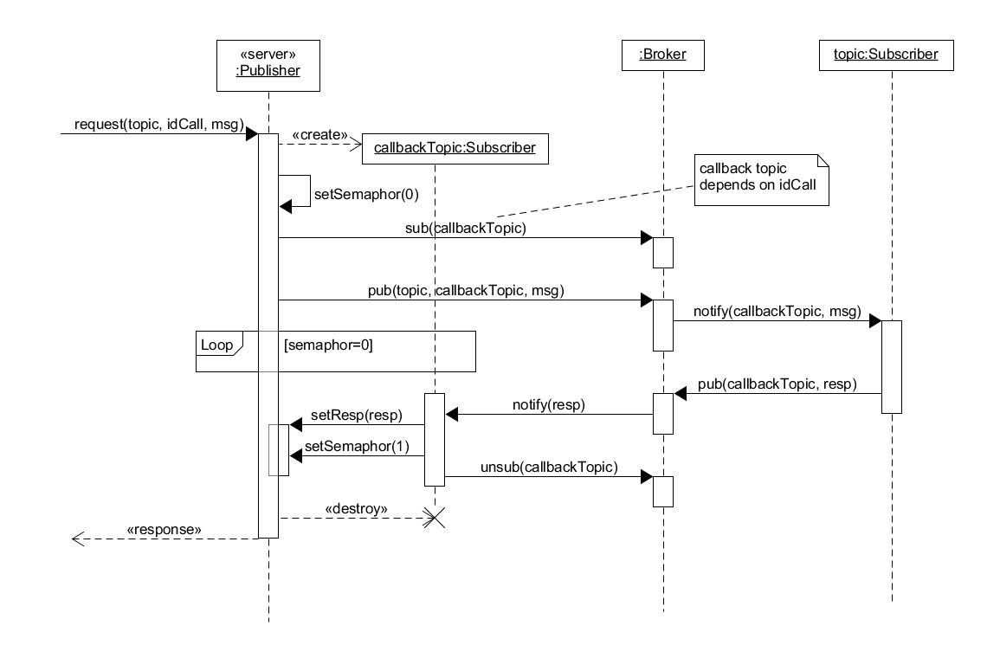
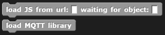

# MQTT4Snap *!*

MQTT4Snap *!*  is a Snap *!*  [library](https://raw.githubusercontent.com/pixavier/mqtt4snap/master/mqtt-standalone.xml) for using [MQTT](https://en.wikipedia.org/wiki/MQTT) in [Snap *!*](http://snap.berkeley.edu) and [Snap4Arduino](http://snap4arduino.rocks).

The default broker is  [test.mosquitto.org](https://test.mosquitto.org). It is normally available, and it is intended to be used for proofs of concepts. If reliabiliy is needed, it is strongly recommended to use your own broker. [Mosquitto](https://mosquitto.org) is a popular open-source option, fast and easy to install. For accessing from a browser, [WebSockets support must be activated](http://www.steves-internet-guide.com/mqtt-websockets) for MQTT4Snap *!* to work. [MQTT Explorer](http://mqtt-explorer.com) is an excellent tool for monitoring broker activity.

## [Hello World!](https://snap.berkeley.edu/snap/snap.html#open:https://raw.githubusercontent.com/pixavier/mqtt4snap/master/HelloWorld.xml)

[**Hello World! without SSL**](http://extensions.snap.berkeley.edu/snap/snap.html#open:http://raw.githubusercontent.com/pixavier/mqtt4snap/master/HelloWorld_NoSSL.xml) is also available without SSL., that lets connect to local MQTT broker such as Mosquitto at localhost.

Here you can run a [minimum environment](https://snap.berkeley.edu/snap/snap.html#open:https://raw.githubusercontent.com/pixavier/mqtt4snap/master/MQTT_MinEnv.xml) example. It is also available [without SSL](http://extensions.snap.berkeley.edu/snap/snap.html#open:http://raw.githubusercontent.com/pixavier/mqtt4snap/master/MQTT_MinEnvNoSSL.xml).

## Blocks and usage

If you just want to import the MQTT4Snap *!* blocks library, select and copy the following URL to the clipboard, and then paste it when importing into Snap *!*:

    https://raw.githubusercontent.com/pixavier/mqtt4snap/master/mqtt-standalone.xml

##
Here you can see the blocks and a minimum example:
###

WebSocket protocol (ws:// or wss://) can be specified in the broker field. If not specified, if the Snap *!* webpage is http:// type, then ws:// is used, and if it is https:// type then wss:// is used.

### pub / sub blocks

The **pub** and **sub** blocks are suitable for PubSub architecture based implementations.

### request / response blocks

The **request** and **response** blocks are suitable for an asynchronous client-server architectural approach on a PubSub based infrastructure.

PubSub architectures, with a one-time subscription, can be considered as a generalization of Client-server architectures.

### request reporter block

The **request** block is suitable for a synchronous client-server architectural approach on a PubSub based infrastructure.

PubSub architectures can be considered as a generalization of Client-server architectures:

- An asynchronoys request-response can be converted into synchronous with a response waiting semaphore based mechanism.
- Synchronous request-response can be emulated in PubSub with a one-time subscription (one-to-one) and a waiting semaphore. 
- PubSub can be emulated in Client-server if all agents can play both client and server roles.

Waiting semaphores can be improved adding timeout management.

### disconnect block

The **disconnect** block accepts the value **all** as a parameter, and then it closes all existing connections to the MQTT brokers.

**Note:** This library allways work with [MQTT Quality of Service (QoS)](http://www.steves-internet-guide.com/understanding-mqtt-qos-levels-part-1) level 0.

## MQTT.js library

MQTT4Snap *!* is based on the [MQTT.js](https://github.com/mqttjs/MQTT.js) library, and loads it on the fly using the "load JS from url". The "load MQTT library" block sets the version used from the [UNPKG CDN repo](https://unpkg.com/mqtt/).

## Acknowledgents

This project wouldn't exist without:

- [MQTT.js](https://github.com/mqttjs/MQTT.js)
- The "load JS from url" and "load MQTT library" blocks from [Bernat Romagosa](https://github.com/bromagosa)
- The mqttWildcard matching function, adapted from [https://github.com/hobbyquaker/mqtt-wildcard] 

