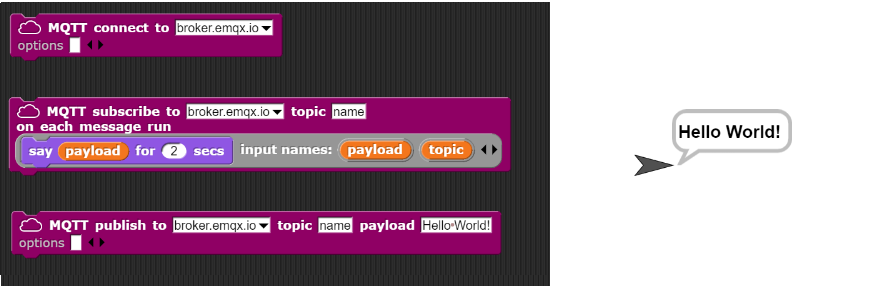

# MQTT4Snap *!*

MQTT4Snap *!*  is a Snap *!*  library for using [MQTT](https://mqtt.org) in [Snap *!*](http://snap.berkeley.edu) (in the cloud) and [Snap4Arduino](http://snap4arduino.rocks) (in the edge).

MQTT is an open and [secure](
https://github.com/pixavier/mqtt4snap/raw/master/doc/ASecurePublish_SubscribeProtocolForInternetOfThings.pdf) publish-subscribe protocol for the Internet of Things, suitable for industrial applications and [Digital Twins](https://www.digitaltwinconsortium.org/initiatives/the-definition-of-a-digital-twin.htm).

There are several [MQTT public server/brokers](https://iotbyhvm.ooo/mqtt-public-brokers) for rapid testing purpose, such as [test.mosquitto.org](https://test.mosquitto.org), [mqtt.eclipseprojects.io](https://mqtt.eclipseprojects.io/) or [www.emqx.com/en/mqtt/public-mqtt5-broker](https://www.emqx.com/en/mqtt/public-mqtt5-broker). Never use these servers for production. One way to start is using [Mosquitto](https://mosquitto.org) on your own server, which is a popular open-source option available for Linux, Windows and Mac, fast and easy to install. For accessing directly to a MQTT broker from a browser, [WebSockets support must be activated on the broker](http://www.steves-internet-guide.com/mqtt-websockets).
To monitor de broker activity, [MQTT Explorer](http://mqtt-explorer.com) is an excellent free tool.

Snap *!* can be considered a block-based [low-code programming language](https://upcommons.upc.edu/handle/2117/363087?locale-attribute=en), unlike [Node-RED](https://cookbook.nodered.org/mqtt/connect-to-broker), that can be regarded as a flow-based low-code tool.

## [Hello World!](http://extensions.snap.berkeley.edu/snap/snap.html#run:http://raw.githubusercontent.com/pixavier/mqtt4snap/master/examples/HelloWorld.xml)
This Hello World! example shows how Snap *!* can help to implement PubSub-based architectures with frictionless user experience. The example can be extended with IoT devices like [this](https://wokwi.com/projects/344419550728553044) (device Digital Twin in this case).

## Blocks and usage

This demo shows step by step the basic functionalities. If you use secured pages you will need the first option, else, for non secured pages, you will need the second one (without SSL):

## [Demo](https://snap.berkeley.edu/snap/snap.html#open:https://raw.githubusercontent.com/pixavier/mqtt4snap/master/examples/Demo.xml)
(The [new extension](https://snap.berkeley.edu/versions/dev/libraries/mqttExtension.js) is available in the Snap *!* library list as "MQTT" and does not need the activation of JavaScript extensions)

## [Demo (Without SSL)](http://extensions.snap.berkeley.edu/snap/snap.html#open:http://raw.githubusercontent.com/pixavier/mqtt4snap/master/examples/Demo.xml)

Usually, the default brokers configuration only works with **http** pages (no **https**). Using **http** you can connect to a default local Mosquitto imstallation at localhost.

##

Here you can see a minimum example (please consult the blocks help):

###

WebSocket protocol (ws:// or wss://) can be specified in the broker field. If not specified, if the Snap *!* webpage is http:// type, then ws:// is used, and if it is https:// type then wss:// is used.

**JSON block** helps to manage JSON messages:

Click here to execute a **[JSON block example](https://snap.berkeley.edu/snap/snap.html#open:https://raw.githubusercontent.com/pixavier/mqtt4snap/master/examples/DemoMQTT_JSON.xml)**. You can export the JSON block and then import it in your project.

We can combine Snap *!* programs with a [remote joystick](https://pixavier.github.io/mqtt4snap/LateralProjects/joystick/index.html) via MQTT (in [LateralProjects](https://github.com/pixavier/mqtt4snap/tree/master/LateralProjects/joystick)).

**[Old library demo](https://snap.berkeley.edu/snap/snap.html#open:https://raw.githubusercontent.com/pixavier/mqtt4snap/master/examples/DemoOld.xml)**
(JavaScript extensions must be ticked with the old version when using old library)

**[Old library demo (without SSL)](http://extensions.snap.berkeley.edu/snap/snap.html#open:http://raw.githubusercontent.com/pixavier/mqtt4snap/master/examples/DemoOldNoSSL.xml)**

If you want to import the old MQTT4Snap *!* blocks library, copy the following URL to the clipboard and paste it when importing into Snap *!*:

    https://raw.githubusercontent.com/pixavier/mqtt4snap/master/LateralProjects/old_dist/mqtt-standalone.xml

### pub / sub blocks

The **pub** and **sub** blocks are suitable for PubSub architecture based implementations.

If you get a message when subscribing to a topic is because there is retained note. To clean it, publish an empty message to the topic with the retain flag to false.

### request / response blocks

The **request** and **response** blocks are suitable for an asynchronous client-server architectural approach on a PubSub based infrastructure.  We add the response topic at the end of the calling topic, behind the last @ sign, acting as an call identifier. It enables the responder to publish the response to the response topic. An example of topic is "topicName/readx/@9876.1". The **idCall** corresponds to the responseTopic field introduced in [MQTT 5](https://www.emqx.com/en/blog/mqtt5-request-response). We use the 3.1.1 MQTT version to keep compatibility with microcontroller implementations such as the [PubSubClient library](https://www.arduino.cc/reference/en/libraries/pubsubclient).

### request reporter block

The **request reporter block** is suitable for a synchronous client-server architectural approach on a PubSub based infrastructure, and it is the synchronous version of the previous asynchronous **request block** based on the response topic. Some similar idea implementations such as the Node.js [Replyer module](https://github.com/jsdario/replyer) are available. Find here a minimum [Python server and client implementations](https://github.com/pixavier/mqtt4snap/tree/master/python) of a synchronous MQTT 3.1.1 echo server for the **request block** reporter testing. Find here a minimum synchronous MQTT 3.1.1 callback function [implemented on an ESP32 microcontroller](https://wokwi.com/projects/328227183923298899).

The **example MQTT response report block** combined with the **response block** shows the same echo example fully implemented in Snap *!*.

PubSub architectures can be considered as a generalization of client-server architectures:

- An asynchronous request-response can be converted into synchronous with a response waiting semaphore based mechanism.
- Synchronous request-response can be emulated in PubSub with a one-time subscription (one-to-one) and a waiting semaphore. 
- PubSub can be emulated in client-server if all agents can play both client and server roles.

The waiting semaphore can be improved by adding timeout management.

Synchronous and asynchronous client-server can be represented in UML, regarding the arrowheads and the activation boxes:

### unsubscribe / disconnect blocks

The **unsubscribe** block cancels a specific subscription.
The **disconnect** block accepts the value **all** as a parameter, and then it closes all existing connections to the MQTT brokers.

**Note:** This library always works with [MQTT Quality of Service (QoS)](http://www.steves-internet-guide.com/understanding-mqtt-qos-levels-part-1) level 0.

## Example: Controlling IoT electronic devices

Snap *!* can be used for controling and testing IoT devices. [Here](https://www.youtube.com/watch?v=L1kAdtWJoAE&t=15m41s) you can see a demo with a physical twin at the Snap!Con 2021.

[Wokwi](https://wokwi.com) is an online Digital Twin for IoT developments. You can see an executable MQTT example [here](https://wokwi.com/projects/341895401936257620), which can [be controlled and tested](https://snap.berkeley.edu/snap/snap.html#open:https://raw.githubusercontent.com/pixavier/mqtt4snap/master/LateralProjects/iot_devices/iot_device_test.xml) with Snap *!*.

## Command-line mode

You can run Snap *!* in command-line mode using a [headless browser](https://en.wikipedia.org/wiki/Headless_browser). To run MQTT4Snap *!* in a headless browser, the JavaScript extensions must be enabled by default. It can be achieved with an own Snap *!* installation (Download source), adding this line of code "Process.prototype.enableJS = true;" in the snap.html script block of code.

## MQTT.js library

MQTT4Snap *!* is based on the [MQTT.js](https://github.com/mqttjs/MQTT.js) library.

**Deprectaed:** The "load MQTT library" block loads the module on the fly from the [UNPKG CDN repo](https://unpkg.com/mqtt/).

## Acknowledgents

This project wouldn't exist without:

- The [Snap *!*  Programming Language](https://en.wikipedia.org/wiki/Snap!_(programming_language)) Project. Thanks to the University of California, Berkeley, and the SAP company for this great free online [Snap *!* course](https://open.sap.com/courses/snap1). 
- [MQTT.js](https://github.com/mqttjs/MQTT.js)
- The "load JS from url" and "load MQTT library" blocks from [Bernat Romagosa](https://github.com/bromagosa)
- The mqttWildcard matching function, adapted from [https://github.com/hobbyquaker/mqtt-wildcard] 

**To [Simon Walters](https://github.com/cymplecy) for its [implementation as the Snap *!* MQTT Extension](https://github.com/pixavier/mqtt4snap/issues/3).**

MQTT4Snap *!*  was presented in the [Snap!Con 2020](https://www.snapcon.org/conferences/2020/program/proposals/63) Conference.

