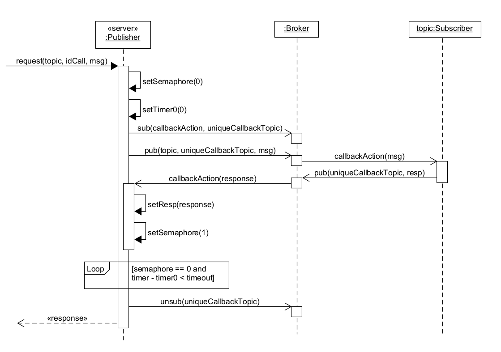

# MQTT4Snap *!*

MQTT4Snap *!*  is a Snap *!*  library for using [MQTT](https://en.wikipedia.org/wiki/MQTT) in [Snap *!*](http://snap.berkeley.edu) and [Snap4Arduino](http://snap4arduino.rocks).

The default broker is  [test.mosquitto.org](https://test.mosquitto.org).

## Usage and blocks

Import (select and copy the following URL to the clipboard, and then paste it when importing into Snap *!*):

    https://raw.githubusercontent.com/pixavier/mqtt4snap/master/mqtt-standalone.xml

##
Here you can see the blocks and a simple example to test:
###

### pub / sub blocks

The **pub** and **sub** blocks are suitable for PubSub architecture based implementations.

### request / response blocks

The **request** and **response** blocks are suitable for an asynchronous client-server architectural approach on a PubSub based infrastructure.

### request reporter block

The **request** block is suitable for a synchronous client-server architectural approach on a PubSub based infrastructure.

The waiting semaphore can be improved adding timeout management.

### disconnect block

The **disconnect** block accepts the value **all** as a parameter, and then it closes all existing connections to MQTT brokers.

## Acknowledgents

Of course, this project wouldn't exist without:

- [MQTT.js](https://github.com/mqttjs/MQTT.js)
- The "fetch JavaScript" block from [Bernat Romagosa](https://github.com/bromagosa)
- The mqttWildcard matching function, adapted from [https://github.com/hobbyquaker/mqtt-wildcard] 

