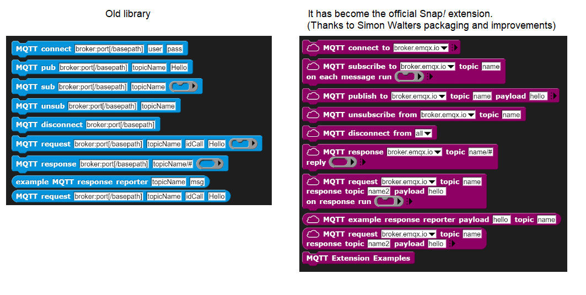

# MQTT4Snap *!*

MQTT4Snap *!*  is a Snap *!*  library for using [MQTT](https://mqtt.org) in [Snap *!*](http://snap.berkeley.edu) (in the cloud) and [Snap4Arduino](http://snap4arduino.rocks) (in the edge).

MQTT is an open and [secure](
https://github.com/pixavier/mqtt4snap/raw/master/doc/ASecurePublish_SubscribeProtocolForInternetOfThings.pdf) publish-subscribe protocol for the Internet of Things, suitable for industrial applications and [Digital Twins](https://www.digitaltwinconsortium.org/initiatives/the-definition-of-a-digital-twin.htm).

There are several free online MQTT server/brokers for rapid testing purpose, such as [test.mosquitto.org](https://test.mosquitto.org) or [www.emqx.io/mqtt/public-mqtt5-broker](https://www.emqx.io/mqtt/public-mqtt5-broker). Never use these servers for production. One way to start is using [Mosquitto](https://mosquitto.org) on your own server, which is a popular open-source option available for Linux, Windows and Mac, fast and easy to install. For accessing directly to a MQTT broker from a browser, [WebSockets support must be activated on the broker](http://www.steves-internet-guide.com/mqtt-websockets).
To monitor de broker activity, [MQTT Explorer](http://mqtt-explorer.com) is an excellent free tool.

Snap *!* can be considered a [no/low code programming language](https://spectrum.ieee.org/tech-talk/computing/software/programming-without-code-no-code-software-development).

## Blocks and usage

You can execute the Hello World! code as a starting point. If you use secured pages you will need the first option, else, for non secured pages, you will need the second one (without SSL):
### (JavaScript extensions must be ticked)
## Try at:  [Hello World!](https://snap.berkeley.edu/snap/snap.html#open:https://raw.githubusercontent.com/pixavier/mqtt4snap/master/HelloWorld.xml)

## Try at:  [Hello World! (without SSL)](http://extensions.snap.berkeley.edu/snap/snap.html#open:http://raw.githubusercontent.com/pixavier/mqtt4snap/master/HelloWorld_NoSSL.xml)

## Try at:  [Hello World! (Snap *!* 7 experimental)](https://snap.berkeley.edu/versions/dev/snap.html#open:https://raw.githubusercontent.com/pixavier/mqtt4snap/master/HelloWorld.xml)

Usually, the default brokers configuration only works with **http** pages (no **https**). Using **http** you can connect to a default local Mosquitto imstallation at localhost.

If you just want to import the MQTT4Snap *!* blocks library, copy the following URL to the clipboard, and then paste it when importing into Snap *!*:

    https://raw.githubusercontent.com/pixavier/mqtt4snap/master/mqtt-standalone.xml

##
Here you can see the blocks and a minimum example:
###

WebSocket protocol (ws:// or wss://) can be specified in the broker field. If not specified, if the Snap *!* webpage is http:// type, then ws:// is used, and if it is https:// type then wss:// is used.

We can combine Snap *!* programs with a [remote joystick](https://pixavier.github.io/mqtt4snap/joystick) via MQTT.

### pub / sub blocks

The **pub** and **sub** blocks are suitable for PubSub architecture based implementations.

### request / response blocks

The **request** and **response** blocks are suitable for an asynchronous client-server architectural approach on a PubSub based infrastructure.

### request reporter block

The **request** block is suitable for a synchronous client-server architectural approach on a PubSub based infrastructure.

PubSub architectures can be considered as a generalization of client-server architectures:

- An asynchronous request-response can be converted into synchronous with a response waiting semaphore based mechanism.
- Synchronous request-response can be emulated in PubSub with a one-time subscription (one-to-one) and a waiting semaphore. 
- PubSub can be emulated in client-server if all agents can play both client and server roles.

Waiting semaphores can be improved by adding timeout management.

Synchronous and asynchronous client-server can be represented in UML, regarding the arrowheads and the activation boxes:

### disconnect block

The **disconnect** block accepts the value **all** as a parameter, and then it closes all existing connections to the MQTT brokers.

**Note:** This library always works with [MQTT Quality of Service (QoS)](http://www.steves-internet-guide.com/understanding-mqtt-qos-levels-part-1) level 0.

## Command-line mode

You can run Snap *!* in command-line mode using a [headless browser](https://en.wikipedia.org/wiki/Headless_browser). To run MQTT4Snap *!*, the JavaScript extensions must be enabled by default. It can be achieved with an own Snap *!* installation (Download source), adding this line of code "Process.prototype.enableJS = true;" in the snap.html script block of code.

## MQTT.js library

MQTT4Snap *!* is based on the [MQTT.js](https://github.com/mqttjs/MQTT.js) library, and loads it on the fly using the "load JS from url" block. The "load MQTT library" block sets the version used from the [UNPKG CDN repo](https://unpkg.com/mqtt/).

## Acknowledgents

This project wouldn't exist without:

- The [Snap *!*  Programming Language](https://en.wikipedia.org/wiki/Snap!_(programming_language)) Project. Thanks to the University of California, Berkeley, and the SAP company for this great free online [Snap *!* course](https://open.sap.com/courses/snap1). 
- [MQTT.js](https://github.com/mqttjs/MQTT.js)
- The "load JS from url" and "load MQTT library" blocks from [Bernat Romagosa](https://github.com/bromagosa)
- The mqttWildcard matching function, adapted from [https://github.com/hobbyquaker/mqtt-wildcard] 

MQTT4Snap *!*  was presented in the [Snap!con 2020](https://www.snapcon.org/conferences/2020/program/proposals/63) Conference.

